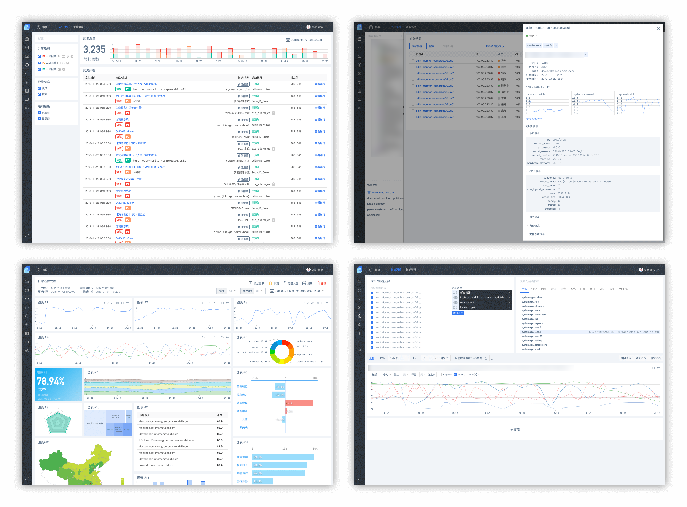
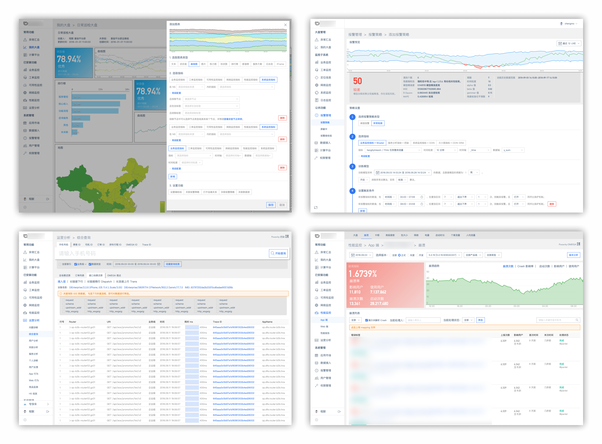
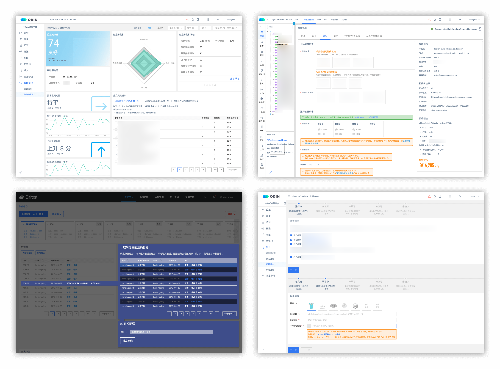
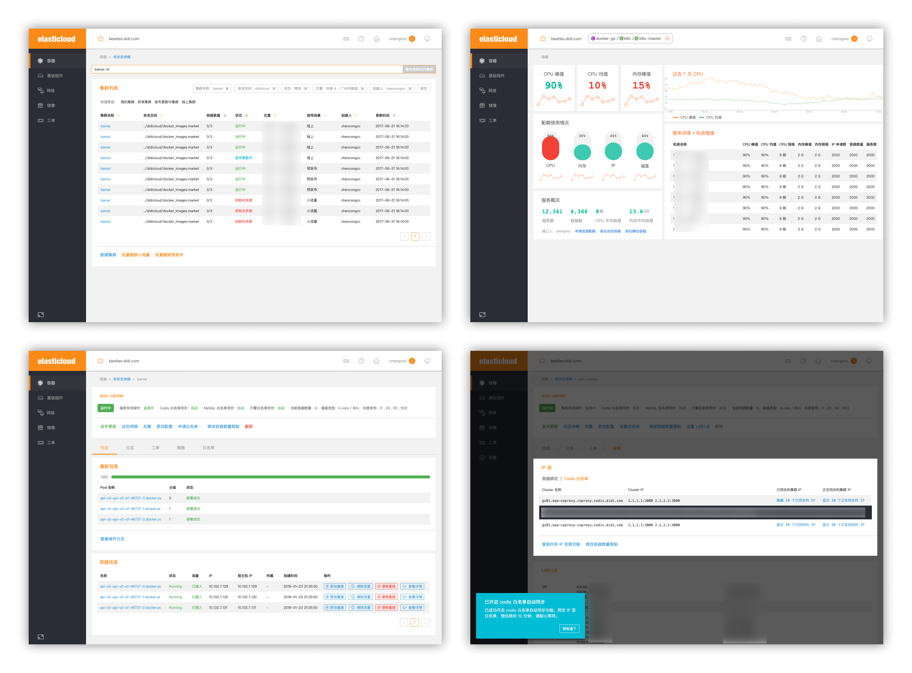
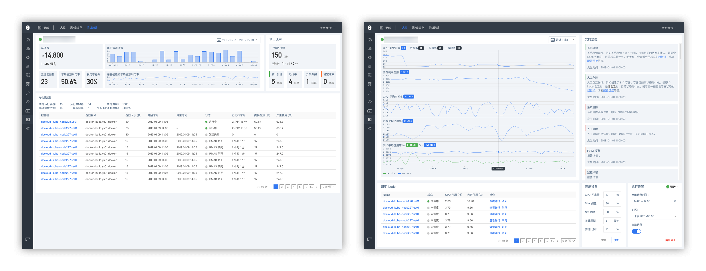

程默

### 联系方式

18601371527  •  [chengmo891@qq.com](mailto:chengmo891@qq.com)

### 工作经历

* 2017 - 现今 • 滴滴出行 • 基础平台部 • 全职
* 2013 - 2017 • OneAPM • 产品中心 • 全职
* 2012 - 2013 • 北京市轨道交通指挥中心 • 票卡室 • 实习

### 教育背景

* 2011 - 2013 • 北京航空航天大学 • 计算机学院 • 硕士
* 2007 - 2011 • 吉林大学 • 软件学院 • 学士

### 项目经历

#### 滴滴，nightingale

nightingale 是整合滴滴云资源向公司外部输出运维产品和管理经验的产品。包括市面通用的 CMDB 和系统监控的相关功能。

目前产品处于研发阶段。

#### 滴滴，滴滴监控 - 2018 - 现今

滴滴监控是一个跨部门的公司级别项目，旨在整合公司各大部门的监控类产品，方便 RD 同学在一个平台下完成系统监控、性能监控、运营监控的工作。

目前产品处于研发阶段。

#### 滴滴，ODIN 一站式运维平台 - 2018 - 现今

ODIN 一站式运维平台是在运维研发组平台较多，用户使用门槛较高的背景下，组内自发希望改善产品设计，来降低用户学习成本，串联运维工作流程而诞生的产品。

任职期间负责优化了数据配送、模块准入、健康分量化体系和 Elasticloud 融合的工作。

目前产品正在逐步向用户进行推广，完成从旧平台的用户迁移工作。

#### 滴滴，Elasticloud - 2017 - 2018

Elasticloud 是公司从物理集群向容器集群迁移大背景下，协助 RD 和 SRE 顺利完成迁移，以及方便日后 SRE 和 Elasticloud 管理员维护 kubernetes 集群的平台。共分为：

* 用户端产品，主要功能包括申请资源、初始化、挂载网络、代码部署等功能。
* 管理端产品，主要功能包括异常 POD 和 Node 的维护与管理、成本统计、混合部署下的资源调度等功能。

产品上线后，协助 SRE 顺利完成了公司海外机器向 Elasticloud 迁移的工作；也侧面地减轻了 RD 同学申请物理机来测试、仿真、小流量的工作量。目前已大面积覆盖了公司的业务逻辑。

#### OneAPM, Cloudinsight — 2015 - 2017

Cloudinsight 是一款面向运维、研发的数据可视化和系统监控平台，是一款 SaaS 产品。能够让运维和研发运用 Cloudinsight 完成系统监控，数据计算、管理、可视化和异常预警的日常工作。

团队维持在 15 人左右，负责产品工作：竞品调研、产品设计、产品运营和部分项目管理工作。产品目前锁定在 5.7.3 版本。活跃用户维持在 3000 企业以上。

#### OneAPM, OneAPM UI — 2014 - 2015

OneAPM UI 库 2.0 是为适应公司发展产品线不停增长带来的 UI 难以统一、前端任务加剧问题，而产生的产品 UI 统一工作。

配合前端部门和设计部门，一起完成 UI 控件重新设计和 React 实现工作。UI 库目前运用在 OneAPM 全线 SaaS 产品中。

#### OneAPM, OneAPM 官网 — 2013 - 2014

OneAPM 官网是全响应式的网站，内容涵盖：产品介绍、解决方案、企业级和报价、公司介绍、新闻和博客、帮助中心、文档中心。

参与了官网的设计工作，并带领了设计师和前端工程师组建临时小组，攻克了全响应难题。设计了「语言之父」活动在开发者社区引流。也指导了其他产品线的文档搭建工作。

### 更多阅读

#### 安利公益基金会，儿童营养地图 Presentation - 2017

* [安利 • 儿童营养地图 • 演示稿](http://tvvomomo.github.io/design/2017/11/22/amway-foundation-presentation.html)

#### 宝珀，珐琅体验线下活动 Presentation - 2017

* [宝珀 • 珐琅 • 演示稿](http://tvvomomo.github.io/design/2017/05/17/blancpain-enamel-presentation.html)

#### 12Swing, 玩兔音乐教育 - 2017

玩兔音乐教育，是天津线下音乐教师的微信服务号线上购课功能。提供选课、选教师和安排上课时间功能。

负责前期产品设计和服务模式规划。目前线下音乐授课正常营业。产品上线半年后，已修改为其他解决方案。

#### 乐视体育，LIVEMAN 直播社区 - 2016

LIVEMAN 直播社区是打通乐视体育旗下智能硬件事业部的诸多硬件与互联网服务的一款全民直播 App。用以连接 LIVEMAN M1, C1 等智能硬件，和借助硬件和手机进行直播。

参与了产品设计的工作，包括了设备连接、操作，单机位和多机位直播。目前该项目已经下线。

#### OneAPM, 知乎内容营销 — 2015

* [为什么很多公司都自主开发监控系统？（Linux运维方面）](https://www.zhihu.com/question/27464246/answer/75205681)
* [开源监控系统中 Zabbix 和 Nagios 哪个更好？](https://www.zhihu.com/question/19973178/answer/75054424)

### [下载简历](../resume.pdf)
